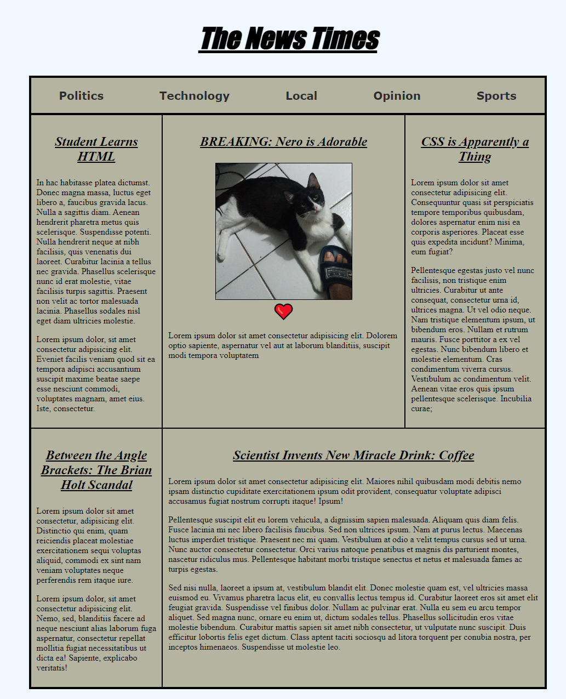

# CSS grid exercise

Exercício praticando uso de display grid e display flex conforme aulas do Brian Holt
## Link para as lições:
- https://btholt.github.io/complete-intro-to-web-dev-v3/lessons/css/putting-it-together

## Link para acesso:
- https://iridescent-eclair-97644b.netlify.app/

## Preview:
